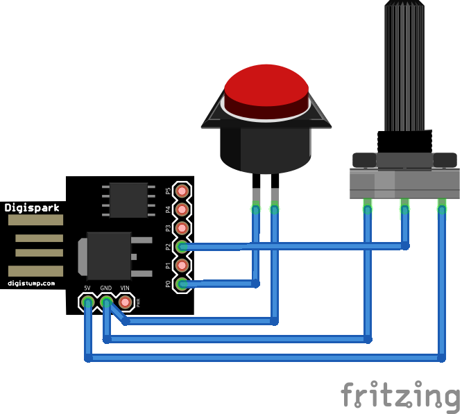

# UsbMidiWah
This project uses a Digispark to emulate an USB MIDI device, to be integrated as Wahwah pedal for digital guitar amplifier software. It reads analog signal from potentiometer and digital signal from on/off switch and sends two MIDI signals containing these information.

# Hardware

Digispark + Potentiometer(s) and switch(es) (as contained in Wahwah pedals like Dunlop CryBaby etc.).
The solution is easily extensible to the amount of analog and digital inputs you want to use.

# Dependencies
https://github.com/heartscrytech/DigisparkMIDI
https://digistump.com/wiki/digispark/tutorials/connecting

# See also
Blog post about this project: https://lars-ra.blogspot.de/2018/02/poor-mans-usb-midi-expression-pedal.html
